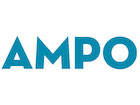
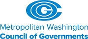
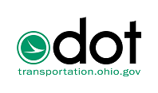
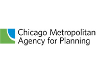

## ActivitySim

The mission of the ActivitySim project is to create and maintain advanced, open-source, activity-based travel behavior modeling software based on best software development practices for distribution at no charge to the public.  

The ActivitySim project is led by a consortium of Metropolitan Planning Organizations (MPOs), Departments of Transportation (DOTs), and other transportation planning agencies, which provides technical direction and resources to support project development.  New member agencies are welcome to join the consortium.  All member agencies help make decisions about development priorities and benefit from contributions of other agency partners. 

<table>
  <tr>
    <td align="center"></td>
    <td align="center"></td>
    <td align="center"></td>
    <td align="center"></td> 
  </tr>
  <tr>
    <td align="center"></td>
    <td align="center"></td>
  	<td align="center"></td> 
    <td align="center"></td>
  </tr>
  <tr>
    <td align="center"></td>
    <td align="center"></td>
    <td align="center"></td>
    <td align="center"></td>
  </tr>
</table>
<table>
  <tr>
    <td align="center"></td>
    <td align="center"></td>
  </tr>
</table>

## Consortium Members

  - [Metropolitan Transportation Commission](https://mtc.ca.gov)
  - [San Diego Association of Governments](http://www.sandag.org)
  - [Atlanta Regional Commission](https://atlantaregional.org)
  - [San Francisco County Transportation Authority](http://www.sfcta.org)
  - [Puget Sound Regional Council](http://www.psrc.org)
  - [Southeast Michigan Council of Governments](http://semcog.org)
  - [Oregon Department of Transportation](https://www.oregon.gov/ODOT)
  - [Metropolitan Council](https://metrocouncil.org/)
  - [Metropolitan Washington Council of Governments](https://www.mwcog.org/)
  - [Ohio Department of Transportation](https://www.transportation.ohio.gov/)
  - [Chicago Metropolitan Agency for Planning](https://www.cmap.illinois.gov/)
  - [Main Roads Western Australia](https://www.mainroads.wa.gov.au/)
  - [Maricopa Association of Governments](https://azmag.gov/)

## Getting Started

  - [ActivitySim Documentation](https://activitysim.github.io/activitysim)
  - [PopulationSim Documentation](https://activitysim.github.io/populationsim)
  - [Open Source Software on GitHub](https://github.com/activitysim)
  - [Management & Governance](https://github.com/activitysim/activitysim/wiki)

<table>
  <tr>
    <td align="center">
        
    </td>
    <td align="center">
        ActivitySim is administered by the Association of Metropolitan Planning Organizations Research Foundation, a Federal 501(c)(3) organization.
    </td>
  </tr>
</table>

