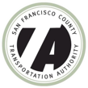

The ActivitySim project emerged from a consortium of Metropolitan Planning Organizations (MPOs) and other transportation planning agencies that wanted to build a shared, open, platform that could be easily adapted to their individual needs, but would share a robust, efficient, and well-maintained common core.

| | | | | 
|-|-|-|-|
|  |  |  | 
|  |  |  |

ActivitySim is administered by the [Association of Metropolitan Planning Organizations](http://www.ampo.org) Research Foundation, a Federal 501(c)(3) organization.